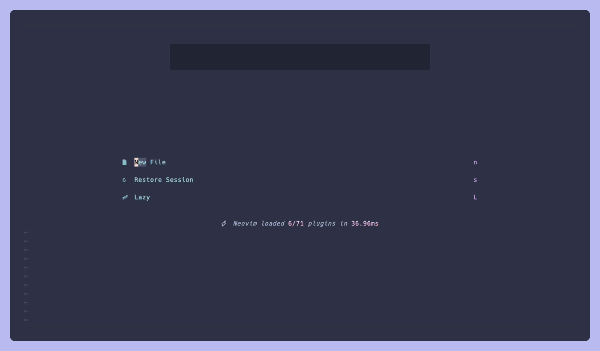
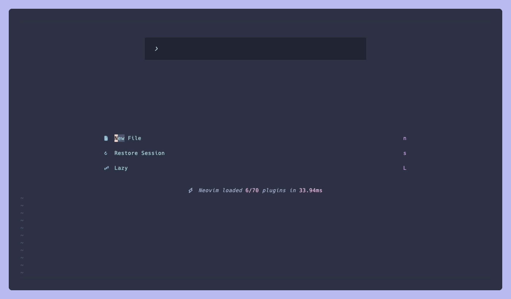
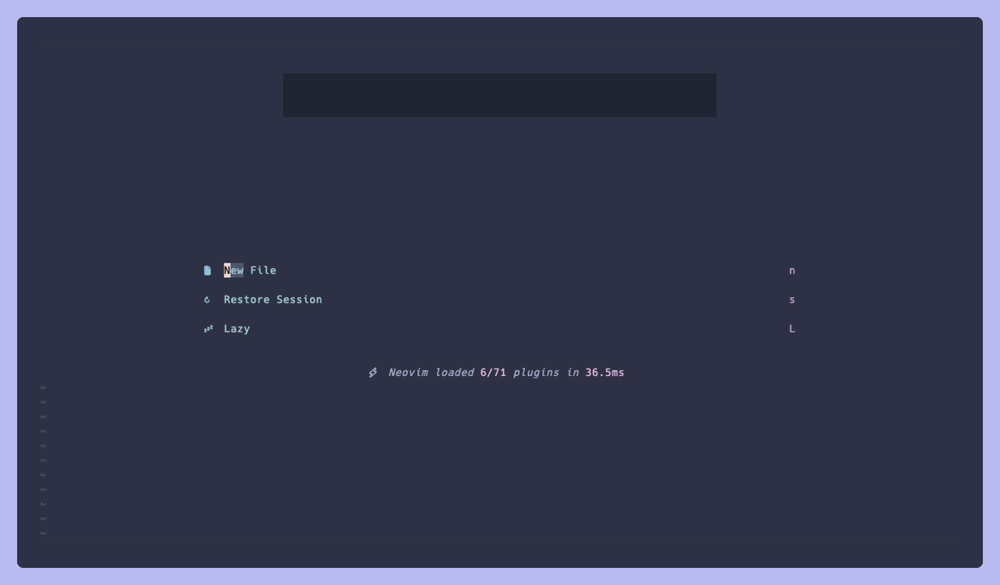

# diffly.nvim

Inspired by [difit](https://github.com/yoshiko-pg/difit).

A file-tree diff viewer for Neovim (like diffview.nvim) with per-file **viewed** marks
that persist across sessions. Diffs render on your real files — not synthetic patch
buffers — so your syntax highlighting and LSP keep working as you review.



## Features

- **A GitHub-PR-style review UI** — a file-tree panel and side-by-side / unified diffs for
  everything changed between your branch and its base (or a detected PR).
- **On your real files, not patch buffers** — diffs render on the actual buffers, so your
  syntax highlighting, LSP, and editing keep working throughout.
- **Persistent viewed marks** per file, kept across sessions and invalidated automatically
  when either side of the diff changes.
- **Line comments** on any line or range, stored locally, rendered inline, and copyable as
  AI-agent prompts.
- **GitHub PR comments**: view a PR's existing review threads inline, and post your own
  comments back as a single review.
- **An agent bridge**: `bin/diffly` lets coding agents read and write the same review
  comments from outside the editor — live into the open UI when one is running, against
  the persisted review otherwise.

Out of scope for v1 (deliberately): arbitrary rev comparison (`difit A B`), staged/working-
only modes, a flat-list panel toggle, filesystem-watch-based refresh.

## Requirements

- Neovim **0.12+**
- `git` on `$PATH`
- Optional: [`gh`](https://cli.github.com/) — enables PR-based base-branch detection and
  PR-keyed viewed state; falls back to a branch-pair key when absent.
- Optional: [mini.icons](https://github.com/echasnovski/mini.nvim) or
  [nvim-web-devicons](https://github.com/nvim-tree/nvim-web-devicons) — enables file icons
  in the panel.

## Installation

Using [lazy.nvim](https://github.com/folke/lazy.nvim):

```lua
{
  "izumin5210/diffly.nvim",
  cmd = "Diffly",
  opts = {},
}
```

`opts = {}` calls `require("diffly").setup({})`; `setup()` is entirely optional otherwise —
the plugin works with its defaults untouched.

## Quickstart

```vim
:Diffly                " review the current branch against its detected base
:Diffly main           " review against an explicit base branch
:Diffly close          " close the review UI and restore your previous layout
:Diffly toggle         " open, or close if already open
:Diffly refresh        " recompute the diff
:Diffly focus          " focus the panel window from wherever you currently are
:Diffly sweep          " bulk-toggle a `viewed_patterns` group (prompts if 2+; see below)
:Diffly sweep {name}   " bulk-toggle one specific group by name, no prompt
:Diffly comments       " list every comment in the review in quickfix
:Diffly submit         " post your local drafts as ONE GitHub review (PR reviews only)
:Diffly clean          " remove viewed state for the current review (prompts first)
:Diffly clean all
```

`:Diffly <Tab>` completes both the subcommands above and your repo's local branch names;
`:Diffly sweep <Tab>` completes the current review's configured group names instead.

### Keymaps

No global keymaps are defined. Everything below is buffer-local and configurable via
`keymaps.universal`/`keymaps.panel`/`keymaps.diff` (see [Configuration](#configuration)).

diffly.nvim uses a two-layer keymap model, modeled on diffview.nvim: a **universal** layer
of leader-prefixed keys that work identically in *every* diffly context — the panel,
diffly-owned diff buffers, and real file buffers shown in the viewer alike — plus **local**
single-key shortcuts that only apply where the buffer is diffly-owned (so they can never
collide with a real file's own, unrelated keymaps).

#### Universal (all diffly windows)

| Key          | Action                                             |
| ------------ | --------------------------------------------------- |
| `<leader>v`  | Toggle viewed for the current file (auto-advances)   |
| `<leader>s`  | Toggle side-by-side ⇔ unified                         |
| `<leader>e`  | Focus the panel                                       |
| `]f`         | Open the next file (ALL files, not just un-viewed ones) |
| `[f`         | Open the previous file (ditto)                        |
| `<leader>ca` | Add a comment on the cursor line, or the visual selection |
| `<leader>ce` | Edit the comment under the cursor                     |
| `<leader>cd` | Delete the comment under the cursor (confirms first)  |
| `<leader>ct` | Collapse/expand inline comment rendering (session-wide) |
| `<leader>cr` | Reveal/hide resolved PR review threads (session-wide) |
| `<leader>cy` | Copy the comment under the cursor as an AI prompt     |
| `<leader>cY` | Copy every comment in the review as one AI prompt     |

Works everywhere: the panel, diffly-owned blob buffers, and real file buffers currently
shown in the viewer — worktree-mode side-by-side's right-hand window, and worktree-mode
unified's single window alike — the one place these keys matter most, since real buffers
get no local shortcuts at all. There is no universal `close`: closing a real file buffer
isn't "closing the review".

`]f`/`[f` always cycle through every file in the review, regardless of the panel's `H`
filter below (see [File panel](#file-panel)) — the filter only changes what's *drawn* in
the tree, never what's *reachable*. Skipping already-viewed files while moving forward is
what `<leader>v`/`v`'s auto-advance is already for.

#### File panel

| Key    | Action                                                     |
| ------ | ------------------------------------------------------------- |
| `<CR>` | Open the file under the cursor / toggle a directory's fold      |
| `v`    | Toggle viewed (auto-advances to the next un-viewed file)        |
| `R`    | Refresh the diff                                                |
| `s`    | Toggle side-by-side ⇔ unified                                    |
| `q`    | Close the review UI                                             |
| `za`   | Toggle fold (mirrors native `za`)                                |
| `H`    | Toggle hiding already-viewed files (display only — see below)   |
| `S`    | Sweep a `viewed_patterns` group (prompts when 2+ are configured; see below) |
| `V`    | On a directory row: bulk-toggle every file in that subtree. On a file row: same as `v` |

`H` only changes what the tree *shows*: progress counts (`3/12 viewed`) stay global, and
navigation (`]f`/`[f`, `<leader>v`'s auto-advance) is entirely unaffected. While active,
the progress line gains a `(hidden)` suffix, e.g. `3/12 viewed (hidden)`. Directories that
end up with no un-viewed files left disappear along with their contents.

`S` and `V` are described in full under [Bulk viewed marking](#bulk-viewed-marking).

#### diffly diff buffers

Diffly-owned buffers only — the side-by-side blob windows, and unified's own blob buffers
(HEAD mode, or a deleted file's read-only content) — never real file buffers, which get
only the universal layer above.

| Key  | Action                              |
| ---- | ------------------------------------ |
| `v`  | Toggle viewed for the current file   |
| `s`  | Toggle side-by-side ⇔ unified         |
| `q`  | Close the review UI                   |
| `ca` | Add a comment (cursor line / visual range) |
| `ce` | Edit the comment under the cursor    |
| `cd` | Delete the comment under the cursor  |
| `ct` | Collapse/expand inline comments      |
| `cr` | Reveal/hide resolved PR review threads |
| `cy` | Copy the comment under the cursor as an AI prompt |
| `cY` | Copy every comment as one AI prompt  |

The comment keys only exist where there is content to anchor to: never on
binary/oversized/generated placeholders, and the base-side variants only in buffers
showing base content (the side-by-side left window — that's also where you comment on
deleted lines).

#### Comments



`<leader>ca` (real file buffers) / `ca` (diffly-owned buffers) opens a small markdown
float anchored at the cursor — type the note, then save with **`:w`** / **`:wq`** or
`<C-s>`; `q` (or saving an empty body) cancels. `:q` on an unsaved body warns like any
unsaved file (`:q!` discards). The `:w` route exists because Ctrl keys are hostage to the
terminal stack — flow control or multiplexer bindings can eat `<C-s>` before Neovim ever
sees it. In visual mode the same key comments on the whole selected range.

Each comment renders as its own boxed block — `╭─ ✎ draft` for your local notes,
`╭─ @author` for PR review threads — so several comments on the same line stay visually
separate, and local drafts are never mistaken for conversations already on GitHub. The body renders
inline right below the commented line (below the *deleted* lines it annotates, for a
base-side comment on removed code); `<leader>ct` collapses every comment down to a `✎`
end-of-line marker when the inline text gets in the way. The panel shows a per-file `✎N`
count.

Comments are stored next to the viewed marks, keyed to the same review, and **follow the
code**: each comment remembers the text it was written against, and when the file changes
— new commits, or an AI agent rewriting it mid-review — the anchor is re-located by
searching for that exact text near its old position. If the commented lines are gone
entirely, the comment turns **outdated**: it stops rendering inline (a note pinned to the
wrong line is worse than none) but stays in the panel count and `:Diffly comments`, where
`[outdated]` / `[base]` markers flag each entry.

**PR review threads.** When the review is keyed to a GitHub PR, the PR's existing review
conversations are fetched through `gh` — asynchronously on open (the UI never waits on
the network), and again on any explicit refresh (`R`, `:Diffly refresh`); saving a file
never triggers a fetch. Threads render read-only in the diff exactly like your local
notes, but attributed (`@author`, replies included) and visually distinct. Unresolved
threads show by default; `<leader>cr` reveals resolved ones. Outdated threads (whose code
is gone from the PR) stay out of the diff but appear in `:Diffly comments` with an
`[outdated]` marker, and every remote entry there is tagged `[@author]`. The panel's `✎N`
count includes unresolved remote threads.

**Submitting a review.** `:Diffly submit` turns your local drafts into one GitHub review.
Every draft is validated against the PR's *real* diff first — drafts on uncommitted
edits, lines outside the diff, ranges crossing hunks, or outdated anchors are reported
and stay local (nothing is ever lost; GitHub's reviews endpoint is all-or-nothing, so
pre-validation is what keeps one bad line from failing the batch). Then you pick the
review event (comment / approve / request changes), optionally type a summary, and one
review lands on the PR — one notification for your reviewers, not one per comment.
Submitted drafts leave the local store and come back through the read-only overlay, so
nothing shows twice. Local `HEAD` must be the PR's head commit (push, pull, or
`gh pr checkout` first — the diff you reviewed must be what you comment on).

Drafts written *before* the PR existed are adopted automatically: the first time the
branch's review opens PR-keyed, comments move from the branch-pair store into the PR
store (viewed marks stay behind, by design).

`<leader>cy` / `<leader>cY` copy comments to the unnamed register (and the system
clipboard when available) in difit's AI-agent prompt format — ready to paste into any
coding agent:

```
src/api/client.ts:L42-L48
this retry loop needs a backoff

=====

src/api/client.ts:L102
copy the error message into the exception
```

`<Plug>` mappings are also available if you'd rather bind your own keys (e.g. to reach
these actions from buffers diffly doesn't map by default):

```lua
vim.keymap.set("n", "<leader>gv", "<Plug>(diffly-toggle-viewed)")
vim.keymap.set("n", "<leader>gs", "<Plug>(diffly-toggle-mode)")
vim.keymap.set("n", "<leader>gp", "<Plug>(diffly-focus-panel)")
vim.keymap.set("n", "]f", "<Plug>(diffly-next-file)")
vim.keymap.set("n", "[f", "<Plug>(diffly-prev-file)")
```

## Agent bridge


`bin/diffly` gives coding agents the same review comments you see in the editor — no
GitHub round-trip, no copy-paste:

```sh
diffly info                                # review metadata: key, base, per-file status
diffly comments list [--remote]            # draft (and PR) threads as JSON
diffly comments add --file F --line N [--end-line M] [--side base|head] --body TEXT|-
diffly comments reply <id> --body TEXT|-   # answer a thread ("addressed in …")
diffly comments rm <id>
diffly navigate --file F --line N          # steer the live editor to a location
```

The CLI finds a running Neovim holding this repo's review (an explicit `--server`, the
hosting terminal's `$NVIM`, or a scan of live instances) and performs every operation
inside it over RPC: writes land in the open UI instantly, and never race the editor's
own saves. Without a live session it operates on the persisted review state through the
same plugin code (`--headless` forces this). Even a Ctrl-Z-suspended editor keeps
answering — the Neovim core runs as a separate server process — so an agent can comment
while the editor sleeps, and `fg` wakes up with the notes already in place.

Everything an agent writes is a normal draft: rendered as `✎ draft @agent`, counted in
the panel, tagged `[@agent]` in `:Diffly comments`, re-anchored when the code moves, and
submitted with the rest of your review. Deliberately not exposed: marking files viewed
(always a human action) and submitting reviews (posting under your GitHub identity is
your call).

### Agent skill

A ready-made [Claude Code skill](https://docs.claude.com/en/docs/claude-code/skills)
that teaches this workflow — read the human's comments as a work queue, reply to
addressed threads, leave attributed findings, never touch viewed marks or submission —
ships with the plugin. Install it with the CLI itself (the plugin path below is where
lazy.nvim puts it; adjust for your plugin manager):

```sh
~/.local/share/nvim/lazy/diffly.nvim/bin/diffly skill install
# or into one project only:
~/.local/share/nvim/lazy/diffly.nvim/bin/diffly skill install --dir .claude/skills
```

The installed `SKILL.md` has that checkout's absolute `bin/diffly` path baked in, so
agents need nothing on `$PATH`; re-run `skill install` if the plugin directory moves.
(`bin/diffly` uses an `env -S` shebang — on Linux this needs coreutils ≥ 8.30.)

## Configuration

Full defaults, exactly as declared in `lua/diffly/config.lua`:

```lua
require("diffly").setup({
  base = nil,             -- string|nil: base branch override
  right = "worktree",     -- "worktree"|"head"
  include_untracked = true,
  max_file_size = 1024 * 1024, -- bytes; false disables the guard (see "Large files" below)
  collapse_generated = true, -- collapse generated files (see "Generated files" below)
  auto_advance = true,    -- jump to next un-viewed file after marking
  icons = true,           -- use mini.icons / nvim-web-devicons when present
  viewed_patterns = {},   -- glob pattern GROUPS for bulk-viewed marking (`S`/`:Diffly sweep`)
  panel = { width = 35 },
  keymaps = {
    panel = {
      open = "<CR>",        -- open file diff / toggle fold on a dir row
      toggle_viewed = "v",
      refresh = "R",
      toggle_mode = "s",    -- side-by-side <-> unified
      close = "q",
      fold = "za",
      toggle_hide_viewed = "H", -- hide/show already-viewed rows (display only)
      sweep = "S",                  -- sweep a `viewed_patterns` group (prompts if 2+)
      toggle_viewed_subtree = "V",  -- bulk-toggle every file under a dir row
    },
    -- applied ONLY in diffly-owned buffers (blob/unified), IN ADDITION to keymaps.universal
    diff = {
      toggle_viewed = "v",
      toggle_mode = "s",
      focus_panel = "<leader>e",
      close = "q",
      comment_add = "ca",      -- normal: cursor line; visual: the selected range
      comment_edit = "ce",
      comment_delete = "cd",
      comment_toggle = "ct",   -- collapse/expand inline comments (session-wide)
      comment_toggle_resolved = "cr", -- reveal/hide resolved PR review threads
      comment_copy = "cy",     -- AI prompt for the comment under the cursor
      comment_copy_all = "cY", -- AI prompt for every comment in the review
    },
    -- the universal layer: works everywhere (panel, owned diff buffers, AND real file
    -- buffers shown in the viewer); real file buffers get ONLY this group
    universal = {
      toggle_viewed = "<leader>v",
      toggle_mode = "<leader>s",
      focus_panel = "<leader>e",
      next_file = "]f", -- open the next file (ALL files, unaffected by keymaps.panel's H)
      prev_file = "[f", -- open the previous file (ditto)
      comment_add = "<leader>ca",
      comment_edit = "<leader>ce",
      comment_delete = "<leader>cd",
      comment_toggle = "<leader>ct",
      comment_toggle_resolved = "<leader>cr",
      comment_copy = "<leader>cy",
      comment_copy_all = "<leader>cY",
    },
  },
})
```

Set any keymap value to `false` to disable it.

## Highlights

The side-by-side diff palette is asymmetric — the left (before) pane only ever shows
red-family highlights, the right (after) pane green-family, and alignment filler rows are
muted, so removed/added code reads at a glance (the same reading
[delta](https://github.com/dandavison/delta) and
[difftastic](https://github.com/Wilfred/difftastic) give you). Colors are derived from
your active colorscheme and re-derived whenever it changes:

| Group | Derived from | Paints |
| --- | --- | --- |
| `DifflyDiffOldLine` | your `DiffDelete` bg | left pane: changed + deleted lines |
| `DifflyDiffOldText` | same hue pushed toward `Removed` fg, bold | left pane: intra-line changed region |
| `DifflyDiffNewLine` | your `DiffAdd` bg | right pane: changed + added lines |
| `DifflyDiffNewText` | same hue pushed toward `Added` fg, bold | right pane: intra-line changed region |
| `DifflyDiffFiller` | link to `NonText` | `----` alignment filler rows |

The unified view's `DifflyOverlayAdd` / `DifflyOverlayDelete` line highlights link into
the same palette. Every diffly group is defined with `default = true`, so defining your
own version of any group (in your config or a colorscheme) always wins.

Intra-line emphasis comes from Neovim 0.12's default `diffopt` (`inline:char`, plus
`linematch:40` for row alignment). diffly never mutates global options — if you removed
those flags from your `diffopt`, side-by-side falls back to line-level coloring only.

## Large files

Images and other binary files never load their content — both diff modes always render a
placeholder for them, regardless of size. `max_file_size` (1 MiB by default) extends the
same idea to huge *text* files: opening one shows a placeholder like `file too large (2.3
MiB > 1.0 MiB) -- press L to load` instead of loading it into a buffer, with a
buffer-local `L` key to load it anyway for the rest of that view (side-by-side/unified
each track this separately, and it resets on a mode switch or `:Diffly close`). Only
loading a file's content into a diff view is guarded — panel counts (`+`/`-`, status
letters) come from `git diff --numstat`, which stays cheap regardless of file size, so
they're unaffected, and marking a file viewed never requires loading it first. Set
`max_file_size = false` to disable the guard entirely.

## Generated files

Mirrors GitHub's own "Generated files are not rendered by default" PR-diff behavior: a
file recognized as vendored/lockfile/compiler output keeps its row, `+`/`-` counts, and
manual viewed marking in the panel — only its diff body is replaced by a placeholder (`L`
to load it anyway, same per-view mechanics as `max_file_size` above).

Detection is [github-linguist](https://github.com/github-linguist/linguist)'s own
`generated.rb` ruleset (vendored trees like `node_modules/`/`Pods/`/Go's `vendor/`,
lockfiles like `package-lock.json`/`Cargo.lock`/`pnpm-lock.yaml`, and compiler/codegen
markers like Go's `// Code generated ... `, protobuf/gRPC/Thrift headers, minified JS/CSS,
source maps, and more — see `lua/diffly/generated.lua` for the full ported list), plus
`.gitattributes`
[`linguist-generated`](https://github.com/github-linguist/linguist/blob/main/docs/overrides.md)
as an override in BOTH directions: `path linguist-generated` (or `=true`/any non-`false`
value) forces collapsing even for a file the heuristics would otherwise render normally;
`path -linguist-generated` (or `=false`) forces normal rendering even for a heuristic
match — exactly like on github.com, and the only place to configure individual files
(there is no separate diffly-specific pattern list). A working-tree (uncommitted)
`.gitattributes` edit takes effect immediately, without needing to be staged or committed.

Two rules linguist itself doesn't have, so diffly doesn't add them either: no generic
`@generated`-marker rule, no generic "DO NOT EDIT" rule. `yarn.lock`, `Gemfile.lock`, and
`go.sum` are deliberately **not** treated as generated (linguist doesn't either) — if you
want them collapsed anyway, opt them in via `.gitattributes`.

The size guard above always wins when both would apply: an oversized file's content is
never loaded, so the generated-file heuristics (which need to read that content) never run
for it. Binary files keep winning over both. Set `collapse_generated = false` to disable
heuristic AND `.gitattributes`-override collapsing entirely.

## Viewed-state semantics

Viewed marks are keyed by `owner/repo#number` when a GitHub PR is detected for the current
branch via `gh`, or otherwise by the repo identity plus the `base..head` branch pair — the
two keyspaces never mix, by design. Repo identity is the normalized remote URL when one
exists (shared across worktrees/clones), otherwise the worktree's toplevel path.

Marking a file records the pair of blob SHAs (base side, right-hand side) it had at that
moment; if either side no longer matches at render time, the file counts as un-viewed
again (GitHub-style invalidation), while files nobody touched keep their mark across any
number of new commits. See `:help diffly-viewed-state` for the full details.

## Bulk viewed marking

Marking files "viewed" is still manual-trigger-only — nothing is ever marked as a side
effect of scrolling, opening, or refreshing a diff. `S` (panel) / `:Diffly sweep [group]` and
`V` (panel) are just two more explicit triggers, for when you want to mark (or unmark)
several files at once instead of one `v` press per file — e.g. lockfiles and generated
output you never intend to read line-by-line.



**`viewed_patterns`** — an ordered list of pattern **groups**, matched against every file in
the current diff. Each item is either:

- a plain glob **string** — every such string collects into one implicit group named
  `"default"`, positioned wherever the first string appears in the list (this is the
  pre-groups shape, kept working exactly as before); or
- a **table** `{ name = "...", patterns = {...} }` for an explicitly named group, so
  unrelated batches (e.g. lockfiles vs. generated output) can be swept independently.

Within a group, glob semantics are unchanged from before groups existed:

- A pattern with **no `/`** matches the entry's **basename**, anywhere in the tree —
  `"*.lock"` matches both `yarn.lock` and `packages/api/Gemfile.lock`.
- A pattern **containing `/`** matches the **full toplevel-relative path** instead —
  `"dist/**"` matches everything under `dist/`, but not `packages/api/dist/bundle.js`.
- Patterns are compiled with `vim.glob.to_lpeg` (the same glob dialect Neovim's LSP client
  uses): `**` crosses directory boundaries, a single `*` does not.

```lua
require("diffly").setup({
  viewed_patterns = {
    {
      name = "lock files",
      patterns = { "*.lock", "*.sum" }, -- yarn.lock, pnpm-lock.yaml, go.sum, ...
    },
    {
      name = "generated files",
      patterns = { "*.snap", "dist/**", "**/generated/**" },
    },
  },
})
```

Backward compatible: a flat list of strings still works exactly as before —
`viewed_patterns = { "*.lock", "dist/**" }` collapses into one implicit `"default"` group,
so existing configs need no changes.

An invalid pattern is skipped (never raises) and warned about once per Neovim session, not
once per sweep. Two groups sharing the same name merge into the first occurrence the same
way, also warned once.

**`S`** (panel key) / **`:Diffly sweep [{name}]`** sweep a pattern group:

- **0 groups configured** — notifies that `viewed_patterns` isn't set; nothing happens.
- **exactly 1 group configured** — sweeps it immediately, no prompt.
- **2+ groups configured, no `{name}`** — prompts via `vim.ui.select` (`prompt = "Sweep
  pattern group:"`), so telescope/fzf-lua/dressing.nvim/etc. pickers apply automatically if
  you've replaced Neovim's builtin `vim.ui.select`. The first entry is always `all groups
  (N files, M unviewed)` — the union of every group, with a file matched by more than one
  group counted only once — followed by each configured group as `<name> (N files, M
  unviewed)`. Cancelling out of the prompt changes nothing.
- **`:Diffly sweep {name}`** sweeps that one group directly, skipping the prompt entirely —
  matches an exact name first, then falls back to a unique prefix (so `:Diffly sweep lock`
  works when `"lock files"` is the only configured group starting with `"lock"`). A name
  containing spaces works either typed by hand (`:Diffly sweep lock files`) or via `<Tab>`
  completion, which offers the live review's group names with embedded spaces
  backslash-escaped. An unresolved name reports which groups ARE configured instead of
  silently doing nothing.

**`V`** (panel key), pressed on a directory row, bulk-toggles every file in that subtree
instead — no configuration needed; pressed on a file row, it behaves exactly like `v`.

Both a pattern-group sweep and `V` are **tri-state**: if at least one file in the swept
scope is currently un-viewed, the whole batch is marked viewed; only once *every* file in
scope is already viewed does sweeping it again unmark them all. That makes repeating the
same action a clean toggle rather than a one-way ratchet. Each batch persists with a single
save and reports a compact result scoped to what was actually swept, e.g. `diffly: marked 5
files as viewed (lock files)` / `diffly: unmarked 5 files (all groups)`. Progress (`3/12
viewed`) updates exactly like any other mark. `V` on a directory sees the subtree's full
file list regardless of the panel's `H` filter or folds — those are display concerns only,
same as everywhere else in the panel.

`config.auto_advance` applies after a batch exactly like `v`: a batch that **marked** files
jumps to the next un-viewed file afterward; a batch that **unmarked** files never does.

## Development

```sh
make deps   # clone mini.nvim (test dependency) into deps/
make test   # run the full mini.test suite
make lint   # stylua --check
make fmt    # stylua (auto-format)
```

Tests never mock git: `tests/helpers.lua` creates real repositories in temporary
directories, and only the `gh` layer is faked (a PATH shim). See `docs/design.md` for the
design rationale and `docs/architecture.md` for how the plugin is structured.

## Acknowledgements

- [**difit**](https://github.com/yoshiko-pg/difit) by yoshiko-pg — the origin of the
  viewed-marks diff-review experience this plugin brings to Neovim.
- [**diffview.nvim**](https://github.com/sindrets/diffview.nvim) — architecture reference
  for window/layout ownership and view lifecycle patterns.
- [**codediff.nvim**](https://github.com/esmuellert/codediff.nvim) — architecture
  reference for the session registry, cleanup funnel, and inline-overlay rendering model.
